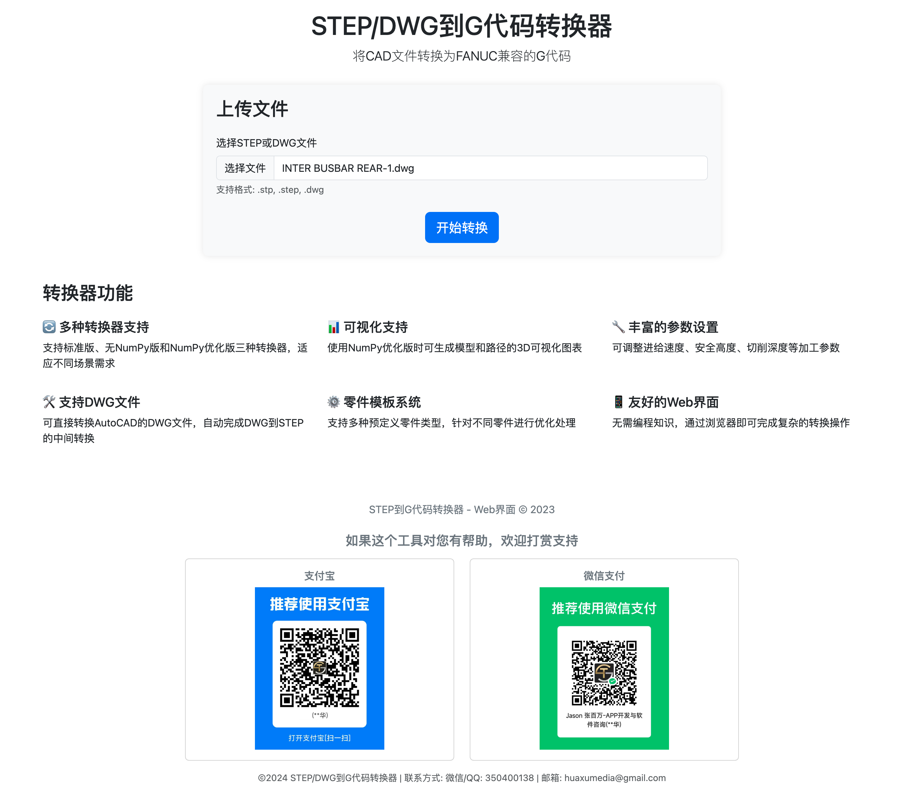
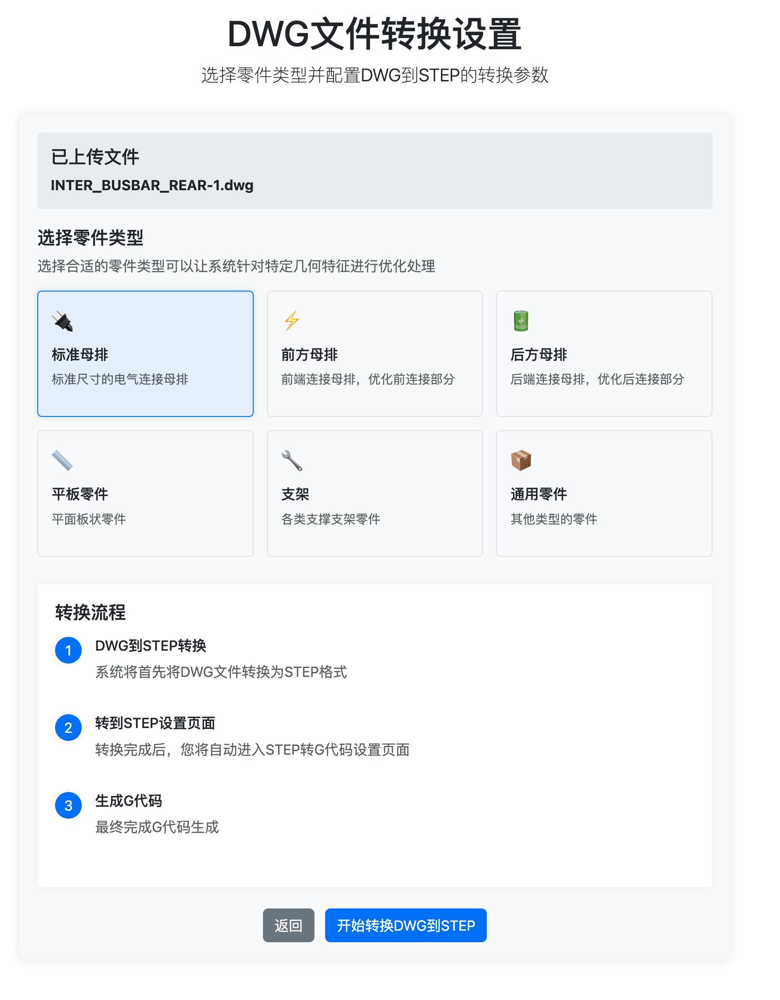
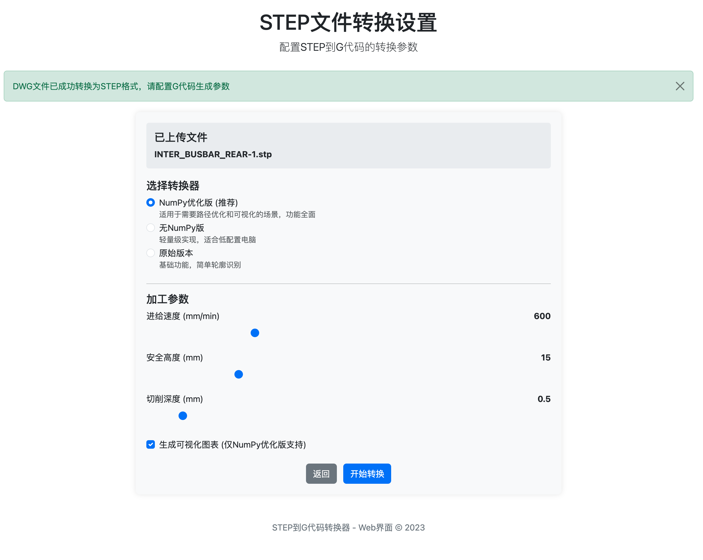

# STEP/DWG到G代码转换器

这是一个将STEP和DWG文件转换为FANUC G代码的工具，支持命令行和Web界面。

## 联系方式

如有任何问题或需要帮助，请通过以下方式联系：
- 微信/QQ: 350400138
- 邮箱: huaxumedia@gmail.com

## Web界面预览

### 主页


### DWG文件转换设置页面


### 转换结果页面


## 功能特点

- **多格式支持**: 支持STEP和DWG文件格式
- **多种转换器**: 提供标准版、无NumPy版和NumPy优化版三种转换器
- **3D可视化**: 生成模型和路径的3D可视化图表
- **灵活参数**: 可自定义进给速度、安全高度、切削深度等加工参数
- **结果分析**: 提供详细的转换结果、预览和统计信息
- **双语支持**: 中文和英文界面

## 快速启动

1. 确保已安装Python 3.7或更高版本
2. 运行启动脚本:

```bash
python start_converter.py
```

启动脚本会自动:
- 检查并安装必要的依赖
- 创建所需的目录结构
- 启动Web服务器
- 打开浏览器访问应用

## 手动启动

如果需要手动启动，请按以下步骤:

1. 安装Flask (如果尚未安装):

```bash
pip install flask
```

2. 启动Web服务器:

```bash
python web_interface.py
```

3. 在浏览器中访问:

```
http://localhost:8888
```

## 使用方法

1. 上传STEP或DWG文件
2. 根据文件类型设置转换参数
3. 点击"开始转换"按钮
4. 等待处理完成
5. 查看和下载转换结果

## 系统要求

- Python 3.7+
- Flask
- NumPy (对于NumPy优化版转换器)
- Matplotlib (用于可视化)

## 支持开发者

如果这个工具对您有所帮助，欢迎打赏支持！

|  支付宝   | 微信支付  |
|  :----:  | :----:  |
|   |  |

## 联系与支持

有问题或建议? 请在GitHub上提交Issue或联系开发者。

---

## English Version

# STEP/DWG to G-code Converter - Web Interface

This is a web application for converting STEP and DWG files to FANUC-compatible G-code, providing an intuitive user interface and powerful conversion capabilities.

## Web Interface Screenshots

### Main Page


### DWG Settings Page


### Results Page


## Features

- **Multi-format Support**: Support for STEP and DWG file formats
- **Multiple Converters**: Standard, No-NumPy, and NumPy-optimized converter options
- **3D Visualization**: Generate 3D visualizations of models and toolpaths
- **Flexible Parameters**: Customize feed rate, safety height, cut depth, and other machining parameters
- **Result Analysis**: Detailed conversion results, previews, and statistics
- **Bilingual Support**: Chinese and English interfaces

## Quick Start

1. Ensure Python 3.7 or higher is installed
2. Run the starter script:

```bash
python start_converter.py
```

## Usage

1. Upload a STEP or DWG file
2. Set conversion parameters based on file type
3. Click the "Start Conversion" button
4. Wait for processing to complete
5. View and download conversion results

## Support the Developer

If this tool has been helpful, please consider making a donation!

|  Alipay   | WeChat Pay  |
|  :----:  | :----:  |
|   |  |

## Contact and Support

Have questions or suggestions? Please submit an issue on GitHub or contact the developer. 