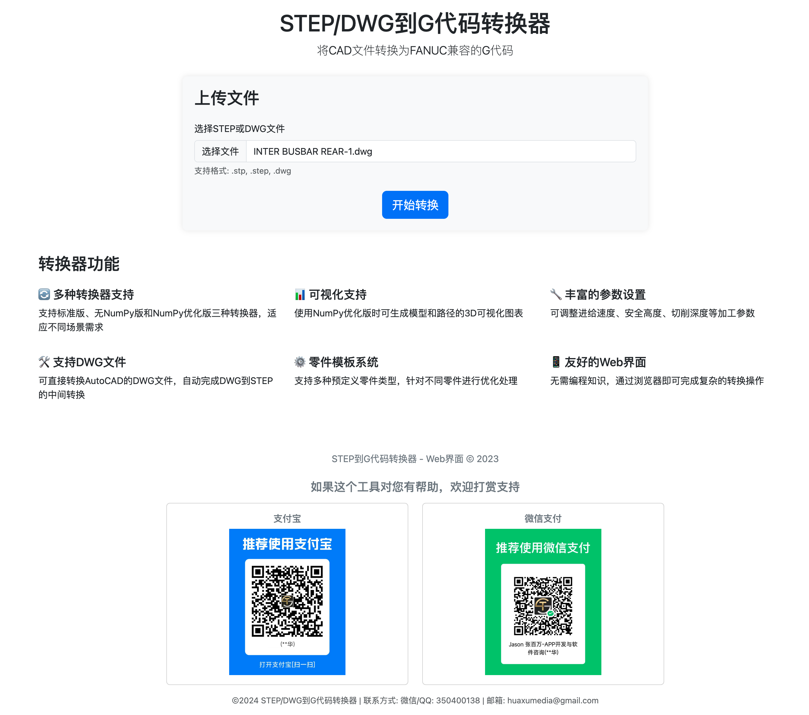
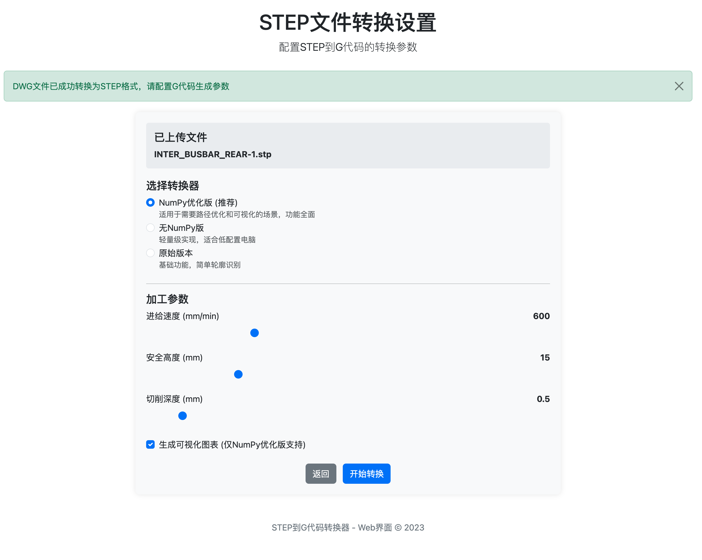

# STEP/DWG到G代码转换器 - Web界面使用指南

本文档提供了STEP/DWG到G代码转换器Web界面的详细使用说明，帮助您快速上手并充分利用所有功能。

## 界面概览

Web界面由三个主要页面组成：

1. **主页** - 文件上传页面
2. **转换设置页面** - 针对STEP/DWG文件的参数设置
3. **结果页面** - 展示转换结果并提供下载选项

## 1. 主页

主页是您开始转换过程的入口，提供了文件上传功能和概述了转换器的主要特点。

### 主要功能：

- **文件上传区域**：选择您要转换的STEP或DWG文件
- **功能概述**：简要展示了转换器的主要特点
- **支持信息**：包含打赏二维码和联系方式

## 2. 转换设置页面

上传文件后，系统会根据文件类型（STEP或DWG）引导您进入相应的转换设置页面。

### DWG文件转换设置页面

对于DWG文件，您可以：

- **选择零件类型**：选择最接近您零件特征的类型模板
  - 标准母排：标准尺寸的电气连接母排
  - 前方母排：前端连接母排，优化前连接部分
  - 后方母排：后端连接母排，优化后连接部分
  - 平板零件：平面板状零件
  - 支架：各类支撑支架零件
  - 通用零件：其他类型的零件

- **了解转换流程**：页面底部说明了DWG到G代码的转换步骤
  1. DWG到STEP转换
  2. 转到STEP设置页面
  3. 生成G代码

### STEP文件转换设置页面

对于STEP文件，您可以设置：

- **转换器类型**：选择标准版、无NumPy版或NumPy优化版
- **进给速度**：设置刀具的进给速度（单位：mm/min）
- **安全高度**：设置刀具移动的安全高度（单位：mm）
- **切削深度**：设置每次切削的深度（单位：mm）
- **可视化选项**：选择是否生成可视化图表（仅NumPy版可用）

## 3. 结果页面

转换完成后，结果页面会展示详细的转换信息和生成的G代码。

### 主要功能：

- **转换信息**：显示源文件、输出文件、行数、估计加工时间和文件大小
- **G代码预览**：显示生成的G代码前100行
- **可视化图表**（如果启用）：
  - 3D模型视图
  - XY平面投影
  - 轮廓图
- **下载选项**：
  - 下载G代码文件
  - 下载可视化图表（如果已生成）
  - 下载转换后的STEP文件（如果是从DWG转换）

## 使用提示

1. **选择合适的转换器**：
   - 标准版：适用于大多数情况
   - 无NumPy版：适用于未安装NumPy的环境
   - NumPy优化版：提供最佳性能和可视化功能

2. **优化参数设置**：
   - 对于精细加工，降低进给速度并减小切削深度
   - 对于粗加工，可提高进给速度并增加切削深度
   - 安全高度应根据零件高度和夹具情况合理设置

3. **利用可视化功能**：
   - 查看3D模型确认几何形状
   - 检查XY投影了解加工路径
   - 分析轮廓图验证特征识别

## 常见问题

1. **上传文件限制**：最大支持50MB的文件
2. **支持的文件格式**：.stp, .step, .dwg
3. **处理时间**：复杂模型可能需要更长处理时间
4. **错误处理**：如遇转换错误，请检查文件完整性和格式

## 联系支持

如有任何问题或需要帮助，请通过以下方式联系：
- 微信/QQ: 350400138
- 邮箱: huaxumedia@gmail.com 